# Three-Tier Student Registration Application

A production-style three-tier web application built with **React, Spring Boot, and MariaDB**, deployed using AWS, Docker, Kubernetes, and Jenkins-based CI/CD.

**Frontend:** React + Amazon S3 + CloudFront<br>
**Backend:** Spring Boot + Docker + Amazon ECR + Amazon EKS<br>
**Database:** Amazon RDS MariaDB

---

## 🏗️ Architecture

<p align="center">
  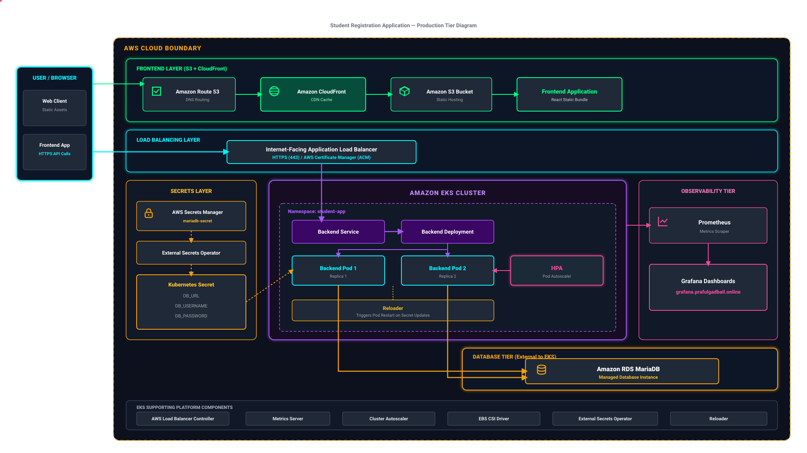
</p>

### Application Flow

```text
User / Browser
      │
      ├──→ Route 53 → CloudFront → S3 → React Frontend
      │
      └──→ Backend API
              │
              ▼
      Application Load Balancer
          HTTPS / ACM
              │
              ▼
         Amazon EKS
        student-app
              │
       Backend Service
              │
         Backend Pods
              │
              ▼
        Amazon RDS
          MariaDB
```

### Supporting Components

```text
AWS Secrets Manager
        ↓
External Secrets Operator
        ↓
Kubernetes Secret
        ↓
Backend Pods
```

```text
EKS → Prometheus → Grafana
```

```text
Metrics Server → HPA → Backend Pods
```

```text
Cluster Autoscaler → EKS Node Capacity
```

---

## 🛠️ Technology Stack

<p align="center">
  
</p>

| Category           | Technologies                                   |
| ------------------ | ---------------------------------------------- |
| Frontend           | React, Amazon S3, CloudFront                   |
| Backend            | Java, Spring Boot, Maven, Docker               |
| Database           | Amazon RDS MariaDB                             |
| Container Registry | Amazon ECR                                     |
| Kubernetes         | Amazon EKS, Kubernetes                         |
| CI/CD              | Jenkins, GitHub                                |
| Code Quality       | SonarQube                                      |
| Networking         | Route 53, Application Load Balancer, ACM       |
| Secrets            | AWS Secrets Manager, External Secrets Operator |
| Monitoring         | Prometheus, Grafana                            |
| Autoscaling        | HPA, Metrics Server, Cluster Autoscaler        |
| Storage            | EBS CSI Driver                                 |
| Operations         | Reloader, Shell Scripting                      |

---

# 🔄 CI/CD

<p align="center">
  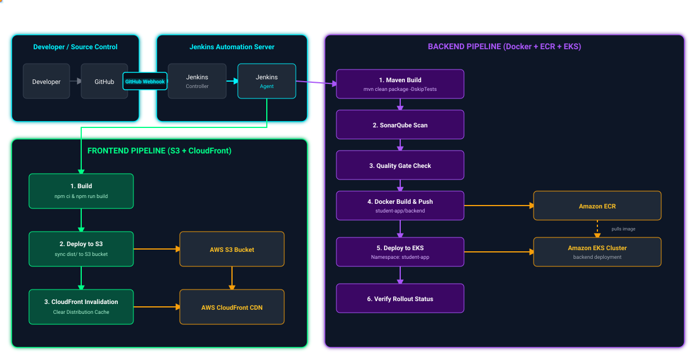
</p>

The application uses **separate Jenkins pipelines for frontend and backend deployments**.

## Frontend Pipeline

```text
GitHub
   ↓
Jenkins Controller
   ↓
Jenkins Agent
   ↓
npm ci
   ↓
npm run build
   ↓
Amazon S3
   ↓
CloudFront Invalidation
```

### Pipeline Stages

* Install dependencies using `npm ci`
* Generate production build using `npm run build`
* Deploy `dist/` to Amazon S3
* Invalidate CloudFront cache

The frontend is deployed as a static application and does not require Docker or Kubernetes.

---

## Backend Pipeline

```text
GitHub
   ↓
Jenkins Controller
   ↓
Jenkins Agent
   ↓
Maven Build
   ↓
SonarQube
   ↓
Quality Gate
   ↓
Docker Build & Push
   ↓
Amazon ECR
   ↓
Amazon EKS
   ↓
Rollout Verification
```

### Pipeline Stages

* Build Spring Boot application using Maven
* Run SonarQube code analysis
* Validate SonarQube Quality Gate
* Build Docker image
* Push versioned image to Amazon ECR
* Update backend deployment in Amazon EKS
* Verify Kubernetes rollout

Backend container images use Jenkins build numbers for versioning.

```text
student-app/backend:<BUILD_NUMBER>
```

---

# ☸️ Kubernetes

The backend application runs in the `student-app` namespace on Amazon EKS.

### Application Resources

* Kubernetes Namespace
* Backend Deployment
* Backend Service
* Application Load Balancer Ingress
* Horizontal Pod Autoscaler
* External Secret

### Backend Deployment

* 2 backend replicas
* RollingUpdate strategy
* `maxUnavailable: 0`
* `maxSurge: 1`

This provides controlled rolling deployments while maintaining application availability during updates.

### Traffic Flow

```text
Internet
   ↓
Route 53
   ↓
Application Load Balancer
   ↓
Ingress
   ↓
Backend Service
   ↓
Backend Pods
```

AWS Load Balancer Controller manages the Application Load Balancer from the Kubernetes Ingress configuration.

---

# 🔐 Security & Secrets Management

Sensitive database configuration is managed outside the application repository.

```text
AWS Secrets Manager
        ↓
External Secrets Operator
        ↓
Kubernetes Secret
        ↓
Backend Deployment
```

### Implementation

* Database credentials stored in AWS Secrets Manager
* External Secrets Operator synchronizes the secret to Kubernetes
* Application consumes credentials through Kubernetes Secret references
* No database password is stored in Git
* HTTPS enabled using ACM
* ALB terminates TLS traffic
* HTTP traffic is redirected to HTTPS

This keeps application configuration separate from sensitive credentials.

---

# 🌐 Networking & HTTPS

The application uses AWS-managed networking components for external access.

```text
Route 53
   ↓
Application DNS
   ↓
Application Load Balancer
   ↓
HTTPS : 443
   ↓
Kubernetes Ingress
   ↓
Backend Service
```

### Components

* **Route 53** — DNS resolution
* **Application Load Balancer** — external traffic routing
* **AWS Load Balancer Controller** — Kubernetes-to-ALB integration
* **ACM** — TLS certificate management
* **HTTPS** — encrypted application traffic

The frontend is delivered through CloudFront, while backend API traffic is routed through the ALB.

---

# 📊 Monitoring & Observability

The Kubernetes environment uses Prometheus and Grafana for workload and cluster visibility.

```text
Kubernetes Cluster
        ↓
    Prometheus
        ↓
     Grafana
        ↓
Dashboards / Metrics
```

### Monitoring Components

* **Prometheus** — metrics collection
* **Grafana** — dashboards and visualization
* **Metrics Server** — Kubernetes resource metrics

Monitoring provides visibility into Kubernetes workloads and infrastructure resources.

---

# 📈 Autoscaling

The project implements both workload-level and cluster-level scaling.

### Horizontal Pod Autoscaler

```text
Metrics Server
      ↓
     HPA
      ↓
Backend Pods
```

HPA manages the backend pod replica count based on configured resource utilization.

### Cluster Autoscaler

```text
Pending Workload
      ↓
Cluster Autoscaler
      ↓
EKS Node Capacity
```

Cluster Autoscaler adjusts node capacity when additional Kubernetes resources are required.

---

# ⚙️ Kubernetes Platform Components

The following platform components are automated through shell scripts:

| Component                    | Responsibility                                              |
| ---------------------------- | ----------------------------------------------------------- |
| AWS Load Balancer Controller | ALB provisioning and Kubernetes Ingress integration         |
| Metrics Server               | Resource metrics                                            |
| EBS CSI Driver               | AWS EBS storage integration                                 |
| External Secrets Operator    | AWS Secrets Manager synchronization                         |
| Cluster Autoscaler           | EKS node scaling                                            |
| kube-prometheus-stack        | Prometheus and Grafana                                      |
| Reloader                     | Reload workloads after watched configuration/secret changes |

---

# 🤖 Platform Automation

The `scripts/` directory contains setup automation for the Kubernetes platform.

```text
scripts/
├── 00-preflight-check.sh
├── 01-setup-aws-load-balancer-controller.sh
├── 02-setup-metrics-server.sh
├── 03-setup-ebs-csi-driver.sh
├── 04-setup-external-secrets.sh
├── 05-setup-cluster-autoscaler.sh
├── 06-setup-kube-prometheus-stack.sh
├── 07-setup-grafana-ingress.sh
├── 08-setup-reloader.sh
├── config.env
└── setup-all.sh
```

The scripts centralize environment configuration and automate installation/configuration of the required Kubernetes platform components.

---

# 📁 Project Structure

```text
three-tier-student-registration-app/
│
├── assets/
│   ├── architecture.svg
│   ├── cicd.svg
│   └── screenshots/
│       ├── 01-live-application.png
│       ├── 02-jenkins-backend.png
│       ├── 03-jenkins-frontend.png
│       ├── 04-sonarqube.png
│       ├── 05-ecr.png
│       ├── 06-eks-kubernetes.png
│       ├── 07-secrets-eso.png
│       ├── 08-alb-https.png
│       ├── 09-grafana.png
│       └── 10-hpa.png
│
├── backend/
│   ├── Dockerfile
│   ├── pom.xml
│   └── src/
│
├── frontend/
│   ├── package.json
│   ├── package-lock.json
│   └── src/
│
├── k8s/
│   ├── namespace.yaml
│   ├── backend.yaml
│   ├── backend-hpa.yaml
│   ├── external-secret.yaml
│   └── ingress.yaml
│
├── scripts/
│   ├── 00-preflight-check.sh
│   ├── 01-setup-aws-load-balancer-controller.sh
│   ├── 02-setup-metrics-server.sh
│   ├── 03-setup-ebs-csi-driver.sh
│   ├── 04-setup-external-secrets.sh
│   ├── 05-setup-cluster-autoscaler.sh
│   ├── 06-setup-kube-prometheus-stack.sh
│   ├── 07-setup-grafana-ingress.sh
│   ├── 08-setup-reloader.sh
│   ├── config.env
│   └── setup-all.sh
│
├── Jenkinsfile-backend
├── Jenkinsfile-frontend
├── .gitignore
└── README.md
```

---

# 🧩 Kubernetes Manifests

| File                   | Purpose                           |
| ---------------------- | --------------------------------- |
| `namespace.yaml`       | Application namespace             |
| `backend.yaml`         | Backend Deployment and Service    |
| `backend-hpa.yaml`     | Backend Horizontal Pod Autoscaler |
| `external-secret.yaml` | AWS Secrets Manager integration   |
| `ingress.yaml`         | ALB Ingress and HTTPS routing     |

Application manifests are kept separate from platform installation scripts.

---

# 📸 Deployment Evidence

## 1. Application

<p align="center">
  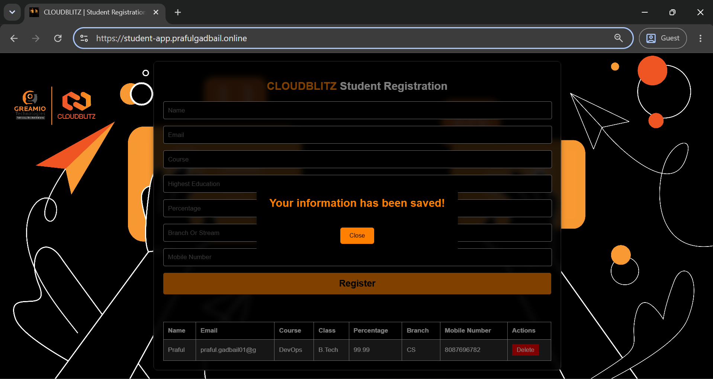
</p>

Application running over HTTPS.

---

## 2. Backend Jenkins Pipeline

<p align="center">
  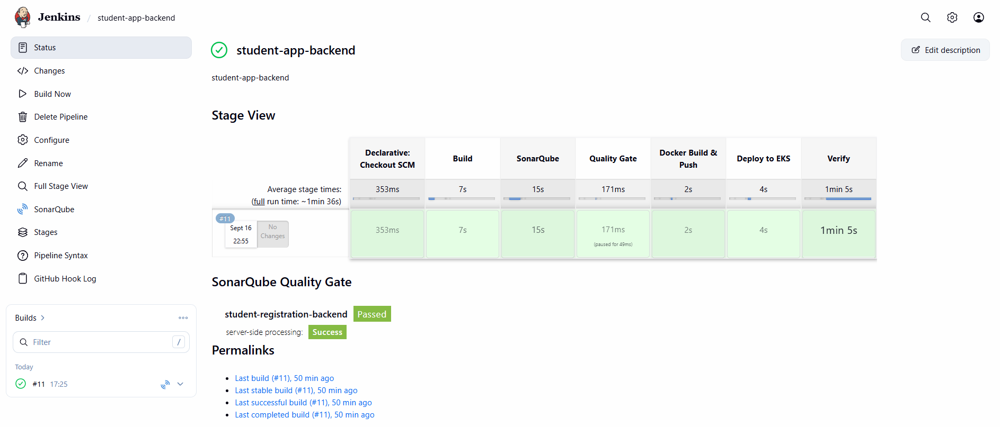
</p>

Backend CI/CD pipeline showing build, SonarQube, Quality Gate, Docker/ECR deployment, EKS deployment, and verification.

---

## 3. Frontend Jenkins Pipeline

<p align="center">
  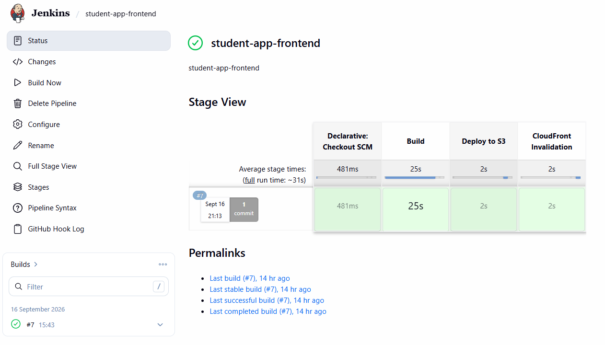
</p>

Frontend CI/CD pipeline showing build, S3 deployment, and CloudFront invalidation.

---

## 4. SonarQube

<p align="center">
  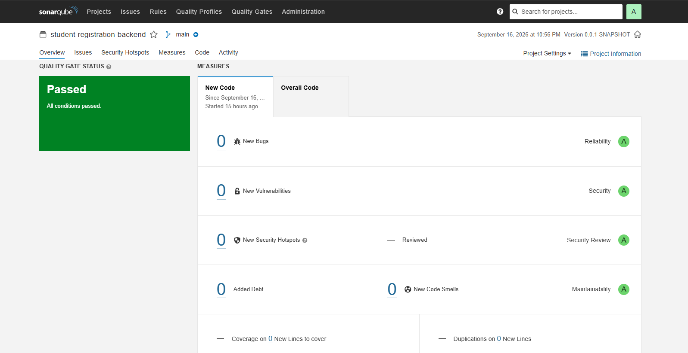
</p>

SonarQube analysis with a successful Quality Gate.

---

## 5. Amazon ECR

<p align="center">
  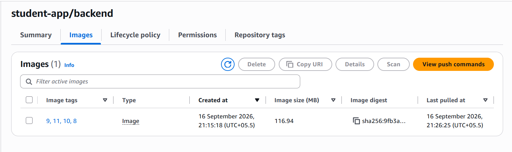
</p>

Versioned backend container images stored in Amazon ECR.

---

## 6. Amazon EKS

<p align="center">
  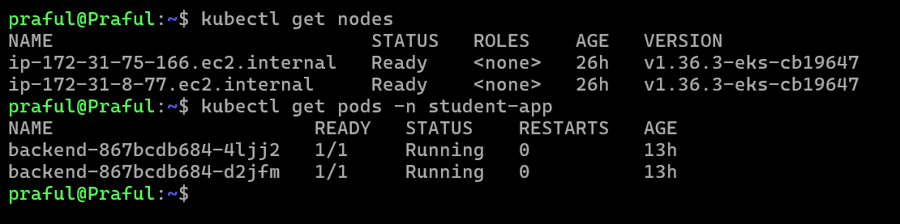
</p>

EKS nodes and backend pods running in the `student-app` namespace.

---

## 7. Secrets Manager + External Secrets

<p align="center">
  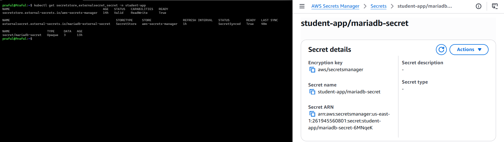
</p>

AWS Secrets Manager and External Secrets Operator integration with Kubernetes.

---

## 8. Application Load Balancer + HTTPS

<p align="center">
  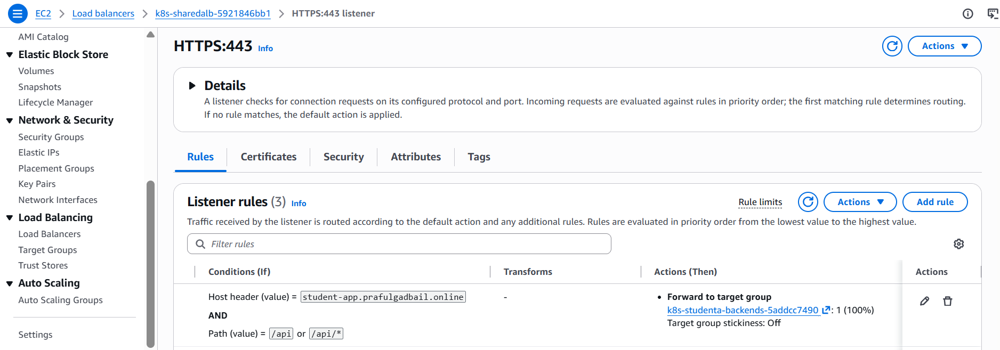
</p>

ALB HTTPS listener and routing configuration using ACM.

---

## 9. Grafana

<p align="center">
  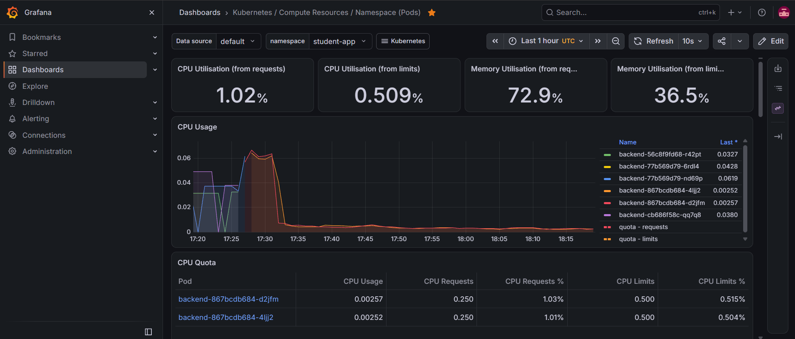
</p>

Kubernetes monitoring and workload visibility through Grafana.

---

## 10. Horizontal Pod Autoscaler

<p align="center">
  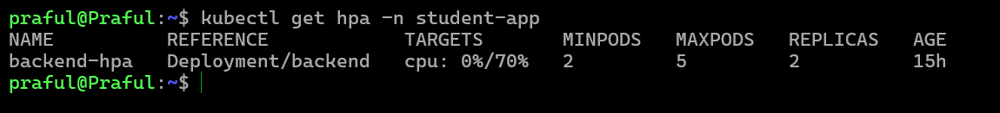
</p>

Backend Horizontal Pod Autoscaler configuration.

---

# 🎯 Technical Highlights

* AWS-based three-tier application architecture
* React frontend hosted on Amazon S3 and delivered through CloudFront
* Spring Boot backend containerized with Docker
* Versioned Docker images stored in Amazon ECR
* Backend deployed on Amazon EKS
* Jenkins Controller-Agent CI/CD implementation
* Separate frontend and backend deployment pipelines
* SonarQube code analysis with Quality Gate enforcement
* Kubernetes rolling deployments
* AWS Load Balancer Controller with ALB Ingress
* Route 53 and ACM-based HTTPS
* AWS Secrets Manager with External Secrets Operator
* Prometheus and Grafana monitoring
* Metrics Server and Horizontal Pod Autoscaling
* Cluster Autoscaler for node capacity management
* EBS CSI Driver for AWS storage integration
* Reloader for configuration/secret change handling
* Shell-based automation for Kubernetes platform components
* Deployment rollout verification

---

# 🔁 End-to-End DevOps Flow

```text
Developer
    ↓
GitHub
    ↓
Jenkins
    ↓
Build & Quality Validation
    ↓
Containerization
    ↓
Amazon ECR
    ↓
Amazon EKS
    ↓
ALB / HTTPS
    ↓
Backend Application
    ↓
Amazon RDS MariaDB
```

Frontend deployment follows a separate path:

```text
Developer
    ↓
GitHub
    ↓
Jenkins
    ↓
npm ci
    ↓
npm run build
    ↓
Amazon S3
    ↓
CloudFront
    ↓
User / Browser
```

---

## 📌 Repository Focus

This repository focuses on the practical implementation of:

**Cloud → CI/CD → Containers → Kubernetes → Security → Networking → Monitoring → Autoscaling**

Application code, CI/CD pipelines, Kubernetes manifests, platform automation, and deployment evidence are organized separately to keep the repository maintainable and easy to review.
